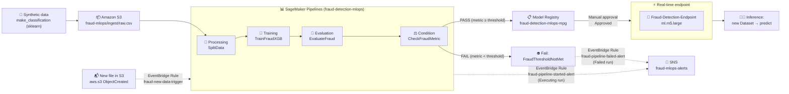
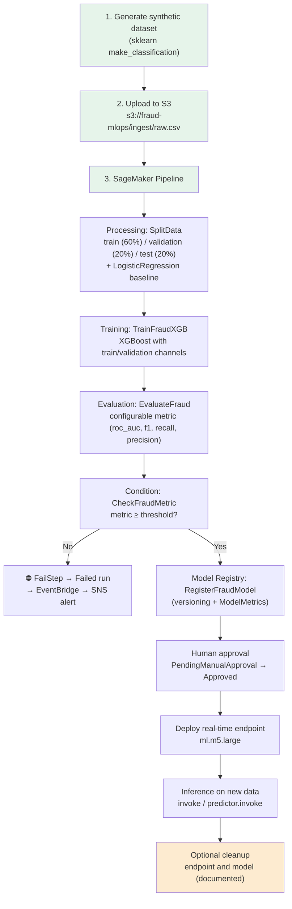
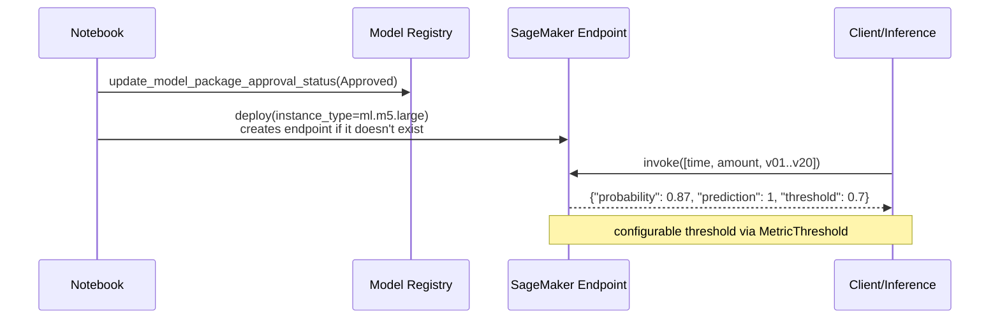

# End-to-End MLOps: Fraud Detection with SageMaker Pipelines

Portfolio project that implements a **complete, end-to-end** MLOps pipeline for fraud detection
in financial transactions, orchestrated from the notebook
[`fraud_detection_mlops.ipynb`](fraud_detection_mlops.ipynb) with all the reusable logic in
[`src/fraud_mlops/`](src/fraud_mlops/).

The goal is to show the real MLOps loop without the frills: lightweight synthetic data,
configurable metrics, human model approval, real-time deployment, automatic pipeline triggering
when new data arrives, and email alerts on start and on failure.

**Table of contents:** [1. AWS Architecture](#1-aws-architecture) · [2. End-to-end MLOps flow](#2-end-to-end-mlops-flow) ·
[3. Project structure](#3-project-structure) · [4. How to run](#4-how-to-run) ·
[5. Key highlights (portfolio)](#5-key-highlights-portfolio) · [6. Deployment and inference (blueprint)](#6-deployment-and-inference-blueprint) ·
[7. Alerts: 30-second check](#7-alerts-30-second-check) · [8. Additional documentation](#8-additional-documentation)

---

## 1. AWS Architecture



**Services used:** S3, SageMaker (Processing, Training, Pipelines, Model Registry, Endpoint),
EventBridge, SNS, IAM.

> Official architecture diagram (draw.io, with AWS icons): [`docs/architecture.drawio`](docs/architecture.drawio).

---

## 2. End-to-end MLOps flow



---

## 3. Project structure

```text
fraud-mlops/
├── README.md                        # This document (overview)
├── requirements.txt                 # Kernel dependencies (SageMaker SDK V3, boto3, ...)
├── .gitignore
├── fraud_detection_mlops.ipynb      # Thin notebook: orchestrates the E2E demo (14 sections)
├── src/fraud_mlops/                 # Reusable package (single source of truth for the logic)
│   ├── config.py                    # Constants + optional environment variables
│   ├── session.py                   # get_sessions(): role, bucket and boto3 clients
│   ├── dataset.py                   # Synthetic dataset, S3 upload, sample rows
│   ├── pipeline.py                  # build_pipeline(): the 4 steps + condition + fail
│   ├── runner.py                    # upsert/start, wait for results, baseline vs model
│   ├── events.py                    # S3→EventBridge, IAM role, SNS topic, rules, alerts
│   ├── deploy.py                    # Model Registry, approval gate, idempotent endpoint
│   ├── inference.py                 # invoke/predict against the endpoint
│   └── cleanup.py                   # Idempotent deletion of all resources
├── code/                            # Scripts that run INSIDE the SageMaker containers
│   ├── preprocess.py                # 60/20/20 split + baseline (Processing)
│   └── evaluate.py                  # Metrics + evaluation.json (Processing)
└── docs/
    ├── ARCHITECTURE.md              # Pipeline detail, components and interactions
    ├── COST.md                      # Estimated costs and how to keep them minimal
    └── architecture.drawio          # Official diagram (draw.io, 4 pages)
```

### Modules and notebook sections

| Notebook section | Module |
|---|---|
| 1. Configuration | `fraud_mlops.config` |
| 2. Sessions | `fraud_mlops.session` |
| 3–4. Dataset + S3 | `fraud_mlops.dataset` |
| 5–10. Pipeline (steps, conditional, register) | `fraud_mlops.pipeline` |
| 10. Run and baseline comparison | `fraud_mlops.runner` |
| 11. Event Trigger (EventBridge/SNS) | `fraud_mlops.events` |
| 12. Deployment (approval + endpoint) | `fraud_mlops.deploy` |
| 13. Inference | `fraud_mlops.inference` |
| 14. Cleanup | `fraud_mlops.cleanup` |

---

## 4. How to run

1. **Install dependencies** (same environment/kernel as the notebook):

   ```bash
   pip install -r requirements.txt
   ```

2. **Optional environment variables** (no code changes needed):

   | Variable | Purpose | Default |
   |---|---|---|
   | `AWS_REGION` | AWS region | `us-east-1` |
   | `SAGEMAKER_ROLE_ARN` | SageMaker role if `get_execution_role()` fails | auto-detected |
   | `SNS_ALERT_EMAIL` | Email to subscribe to the alert topic | no subscription |

3. **Open the notebook** from the repo root and run the cells **in order**:

   ```bash
   jupyter notebook fraud_detection_mlops.ipynb
   ```

4. Sections **1–4** generate the dataset, upload `raw.csv` to S3 and prepare the sessions.
5. Sections **5–9** describe the steps (the definition is in `src/fraud_mlops/pipeline.py`);
   section **10** builds the pipeline and only then launches it (⚠️ it incurs costs, see
   [`docs/COST.md`](docs/COST.md)).
6. Section **11** wires EventBridge + SNS (3 rules: auto-trigger, start alert and failure
   alert) with pattern checks and diagnostics; **12** approval + deploy;
   **13** inference; **14** cleanup (⚠️ required).

**Account requirements:** an IAM role with SageMaker, S3, EventBridge, SNS and IAM permissions
(the notebook auto-detects the role with `get_execution_role()`).

---

## 5. Key highlights (portfolio)

| Criterion | How it is addressed |
|---|---|
| **Baseline for the data** | `code/preprocess.py` trains a LogisticRegression and writes `baseline.json` for comparison. |
| **Configurable metric** | `MetricName` parameter (roc_auc, f1, recall, precision). `evaluate.py` receives it via `--metric` and writes it under a fixed key that `JsonGet` reads. |
| **Configurable threshold** | `MetricThreshold` parameter (float). |
| **Pipeline caching** | `CacheConfig(enable_caching=True, expire_after="PT2H")` on `SplitData` and `EvaluateFraud`: if inputs and code do not change, previous executions are reused. |
| **Model Registry** | `ModelStep` registers a version with `ModelMetrics` (S3: `evaluation.json`) and `ModelApprovalStatus`. |
| **Human approval** | The pipeline only *registers* the model; section 12 does the deployment (manual: `Approved`, or automatic if `ModelApprovalStatus=Approved`). |
| **Hands-on end-to-end** | It really runs: process → train → evaluate → gate → register → deploy → inference → cleanup. |
| **Trigger on new data** | EventBridge rule on `aws.s3` (`ObjectCreated` on `fraud-mlops/ingest/`) that launches the pipeline with `SageMakerPipelineParameters`. |
| **Start and failure alerts** | Two EventBridge rules on `SageMaker Model Building Pipeline Execution Status Change` using the real event fields (`detail.currentPipelineExecutionStatus` + `detail.pipelineArn`): `Executing` → start email, `Failed` → failure email. Direct SNS target (no Lambda); the topic policy authorizes `events.amazonaws.com` to publish and the email subscription is confirmed once. |
| **Alert diagnostics** | `events.check_event_patterns()` validates the patterns with `test-event-pattern` (free, runs nothing) and `events.diagnose_alerts()` checks policy, subscription, rules and trigger/delivery metrics. |
| **Idempotency** | Deploy and cleanup tolerate re-execution (they verify existence first). |
| **Reusable code** | The logic lives in `src/fraud_mlops/`; the notebook orchestrates and documents. The boto3 calls with magic names live only in `config.py`. |
| **Zero secrets in the repo** | Role and alert email are read from environment variables; no hardcoded ARNs or emails. |

---

## 6. Deployment and inference (blueprint)



> Inference returns the fraud probability and the predicted class (0/1) using the configured
> threshold.

---

## 7. Alerts: 30-second check

The pipeline does not send emails by itself (the `FailStep` only puts the run into `Failed`):
that is done by **3 EventBridge rules** targeting the SNS topic. Two checks, free and without
running the pipeline:

```python
from fraud_mlops import events

events.check_event_patterns(sessions)         # does the pattern match the real event?
events.diagnose_alerts(sessions, topic_arn)   # policy + subscription + rules + metrics
```

If an email does not arrive, the cause is almost always one of three things (checkable with
`diagnose_alerts()`): **unconfirmed email subscription** (SNS accepts the message but does not
deliver), **topic policy without `sns:Publish` for `events.amazonaws.com`**, or an **event-pattern
with fields that do not exist** in the real event. The details, the event JSON and the
troubleshooting table are in [`docs/ARCHITECTURE.md`](docs/ARCHITECTURE.md) (section 5).

---

## 8. Additional documentation

- [`docs/ARCHITECTURE.md`](docs/ARCHITECTURE.md): the DAG step by step, parameters, cache, the
  components around the pipeline, the **alerts (EventBridge → SNS)** with the real event and
  troubleshooting, and the minimal IAM permissions.
- [`docs/COST.md`](docs/COST.md): what incurs costs, rough estimate and how to keep it minimal.
- [`docs/architecture.drawio`](docs/architecture.drawio): architecture diagram with official
  AWS icons and the numbered flow (open in draw.io / diagrams.net).

---

*Project built with the SageMaker SDK v3 (MLOps/`sagemaker.mlops`).* The data is 100% synthetic
and generated locally; no external dataset is needed.