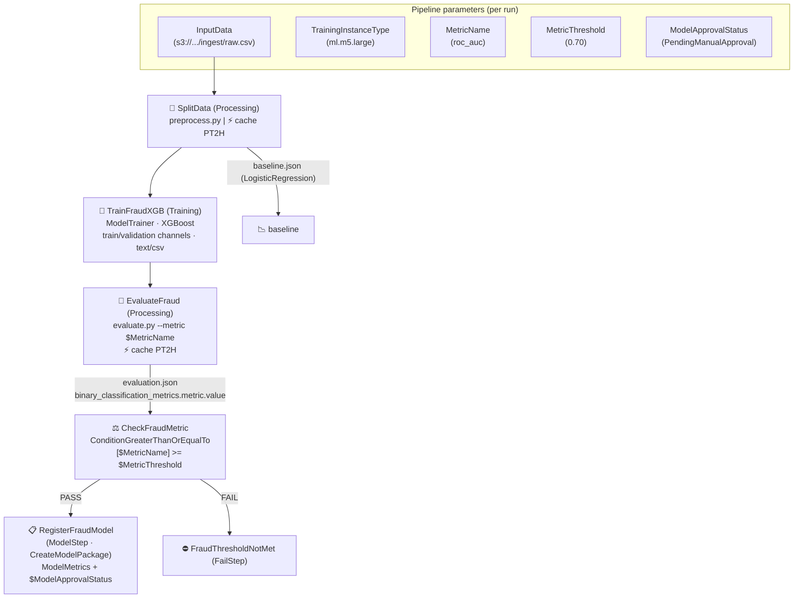
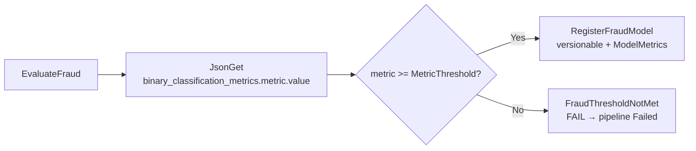
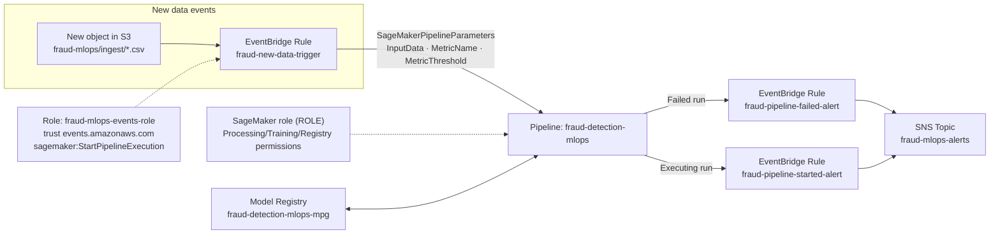
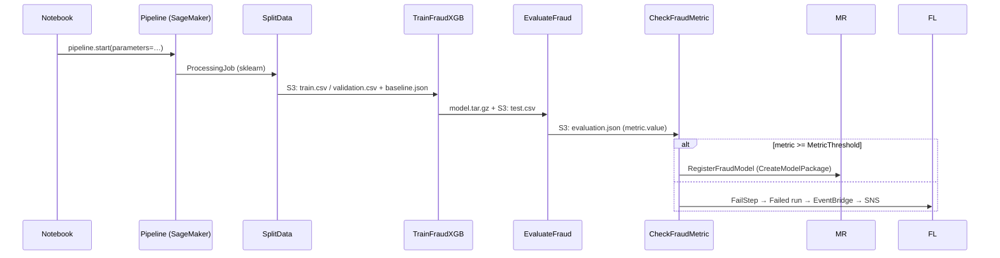

# Architecture and pipeline detail

Technical document for the **fraud-mlops** project. It complements the [`README.md`](../README.md) with the detail of the SageMaker pipeline definition (SDK V3), its parameters, cache and the pieces around it (EventBridge, SNS, IAM).

---

## 1. SageMaker Pipeline DAG



**Execution order:** `SplitData → TrainFraudXGB → EvaluateFraud → CheckFraudMetric → {RegisterFraudModel | FraudThresholdNotMet}`.

---

## 2. Step definitions

### 2.1 `SplitData` (ProcessingStep)

- Image: `image_uris.retrieve(framework="sklearn", version="1.4-2", py_version="py3")`.
- Script: `code/preprocess.py`.
  - Reads `raw.csv` from `InputData`, performs a **60/20/20 holdout** (train/validation/test) and writes it as CSV to S3 (`fraud-mlops/data/{train,validation,test}`).
  - Trains a **LogisticRegression** as *baseline* and writes `baseline.json` (threshold, baseline metrics) to `fraud-mlops/baseline`.
- Cache: `CacheConfig(enable_caching=True, expire_after="PT2H")` — the same input + the same code reuse the step.

### 2.2 `TrainFraudXGB` (TrainingStep)

- `ModelTrainer` with the **XGBoost 1.7-1** image and `Compute(instance_type=TrainingInstanceType, volume_size_in_gb=20)`.
- **File** channels with `content_type="text/csv"` (they point to the outputs of the previous step via `properties`):
  - `train` → `SplitData.Outputs["train"].S3Uri`
  - `validation` → `SplitData.Outputs["validation"].S3Uri`
- Hyperparameters defined in [`src/fraud_mlops/config.py`](../src/fraud_mlops/config.py) (`XGB_HYPERPARAMS`, native XGBoost).

### 2.3 `EvaluateFraud` (ProcessingStep)

- **XGBoost 1.7-1** image (only uses `numpy` + `xgboost`).
- Input: the trained model (`TrainFraudXGB.model_data`) + the `SplitData` test set.
- Script: `code/evaluate.py` receives **`--metric $MetricName`** (parameter-string) and computes the chosen metric.
- Writes `evaluation.json` with the metrics **always under the fixed key** `binary_classification_metrics.metric.value`, so that `JsonGet` (which cannot take parameters) reads it with a static path.
- Cache: `PT2H`; the output depends on the model artifact, so it is recomputed when training changes.

### 2.4 `CheckFraudMetric` (ConditionStep)

- `ConditionGreaterThanOrEqualTo(cond_has_metric, metric_threshold)` where `cond_has_metric = JsonGet(...path="binary_classification_metrics.metric.value", ...)`.
- **`if_steps`** = `[RegisterFraudModel]`
- **`else_steps`** = `[FraudThresholdNotMet]`



### 2.5 `RegisterFraudModel` (ModelStep)

- Uses `ModelBuilder` (XGBoost image + training `model_data`).
- `ModelMetrics` → `MetricsSource` with `evaluation.json` (S3).
- `ModelApprovalStatus` = `ModelApprovalStatus` parameter (default `PendingManualApproval`).
- `InferenceSpecification.SupportedRealtimeInferenceInstanceTypes = [ml.m5.large]`.

> **Design decision (lesson learned):** deployment is **not** a pipeline step. The pipeline only *registers* the version; the approval triggers deployment (see [`README.md`](../README.md) §6).

### 2.6 `FraudThresholdNotMet` (FailStep)

- `FailStep(name="FraudThresholdNotMet", error_message=..., step_args=fail_args)`.
- When the metric does not reach the threshold, the run ends as `Failed` → the EventBridge rule `fraud-pipeline-failed-alert` fires the SNS alert (no Lambda). The start of any run triggers in turn the `fraud-pipeline-started-alert` rule (start email).

---

## 3. Pipeline parameters

| Parameter | Type | Default | Use |
|---|---|---|---|
| `InputData` | `ParameterString` | `s3://…/ingest/raw.csv` | Data source (also received by the trigger) |
| `TrainingInstanceType` | `ParameterString` | `ml.m5.large` | Processing/training instance |
| `MetricName` | `ParameterString` | `roc_auc` | Metric to audit (`--metric`) |
| `MetricThreshold` | `ParameterFloat` | `0.70` | Conditional threshold |
| `ModelApprovalStatus` | `ParameterString` | `PendingManualApproval` | Status used to register the model |

---

## 4. Components around the pipeline



| Piece | Detail |
|---|---|
| **EventBridge `fraud-new-data-trigger`** | `event-pattern`: `aws.s3` → `Object Created` → bucket + prefix `fraud-mlops/ingest/`. Native *SageMaker Pipeline* target with `SageMakerPipelineParameters` (`InputData`, `MetricName`, `MetricThreshold`). |
| **EventBridge `fraud-pipeline-failed-alert`** | `event-pattern`: `aws.sagemaker` → `SageMaker Model Building Pipeline Execution Status Change` → `detail.currentPipelineExecutionStatus = ["Failed"]` + `detail.pipelineArn` (ARN prefix of the pipeline). Target: SNS `fraud-mlops-alerts`. |
| **EventBridge `fraud-pipeline-started-alert`** | Same detail with `detail.currentPipelineExecutionStatus = ["Executing"]` (run start) → SNS `fraud-mlops-alerts`. |
| **IAM role `fraud-mlops-events-role`** | Assumed by `events.amazonaws.com`; policy that allows `sagemaker:StartPipelineExecution` on the pipeline ARN. |
| **SNS `fraud-mlops-alerts`** | Standard topic with 1 email subscription (confirmed). Its **policy** includes the statement `Allow_Publish_Events`: `events.amazonaws.com` → `sns:Publish` (without it EventBridge cannot publish and no email arrives). |

> To replicate these components, the `boto3` calls live in [`src/fraud_mlops/events.py`](../src/fraud_mlops/events.py)
> (`enable_s3_eventbridge` / `disable_s3_eventbridge`, `ensure_events_role`,
> `ensure_sns_topic` + `ensure_eventbridge_publish`, `ensure_event_rules`,
> `check_event_patterns`, `diagnose_alerts`) and are invoked from **section 11** of the notebook.
> Everything is idempotent: creating something that already exists is not an error. The alert
> detail is in [Section 5](#5-alerts-and-notifications-eventbridgesns).

---

## 5. Alerts and notifications (EventBridge/SNS)

The pipeline **does not send emails by itself**: the `FailStep` only puts the run into the `Failed`
state. The emails are issued by **three EventBridge rules** targeting the SNS topic
`fraud-mlops-alerts` (no intermediate Lambdas):

```mermaid
flowchart LR
    S3["S3 · ObjectCreated<br/>fraud-mlops/ingest/"] -->|["rule 1<br/>fraud-new-data-trigger"]| PIPE["Pipeline<br/>fraud-detection-mlops"]
    PIPE -->|"status Executing"| R2["rule 2<br/>fraud-pipeline-started-alert"]
    PIPE -->|"status Failed"| R1["rule 3<br/>fraud-pipeline-failed-alert"]
    R2 --> SNS["SNS fraud-mlops-alerts"]
    R1 --> SNS
    SNS --> MAIL["📧 huillcas…@gmail.com<br/>(confirmed subscription)"]
```

| # | Rule | `event-pattern` condition | Effect |
|---|---|---|---|
| 1 | `fraud-new-data-trigger` | `source = aws.s3`, `detail-type = Object Created`, bucket + prefix `fraud-mlops/ingest/` | Launches a pipeline execution (native SageMaker target with parameters) |
| 2 | `fraud-pipeline-started-alert` | `detail-type = SageMaker Model Building Pipeline Execution Status Change`, `detail.currentPipelineExecutionStatus = ["Executing"]`, `detail.pipelineArn` with *prefix* | **Run start email** |
| 3 | `fraud-pipeline-failed-alert` | Same as #2 but `detail.currentPipelineExecutionStatus = ["Failed"]` | **Failure email** (covers `FraudThresholdNotMet` and any other run failure) |

The `detail.pipelineArn` filter (ARN prefix of the pipeline) makes sure only **this** pipeline is
notified, whether it was launched manually or by rule 1.

### 5.1 The real event (source: [SageMaker documentation](https://docs.aws.amazon.com/sagemaker/latest/dg/automating-sagemaker-with-eventbridge.html))

```json
{
  "version": "0",
  "id": "315c1398-40ff-a850-213b-158f73kd93ir",
  "detail-type": "SageMaker Model Building Pipeline Execution Status Change",
  "source": "aws.sagemaker",
  "account": "111122223333",
  "time": "2021-03-15T16:10:11Z",
  "region": "us-east-1",
  "resources": [
    "arn:aws:sagemaker:us-east-1:111122223333:pipeline/myPipeline-123",
    "arn:aws:sagemaker:us-east-1:111122223333:pipeline/myPipeline-123/execution/p4jn9xou8a8s"
  ],
  "detail": {
    "currentPipelineExecutionStatus": "Succeeded",
    "previousPipelineExecutionStatus": "Executing",
    "pipelineArn": "arn:aws:sagemaker:us-east-1:111122223333:pipeline/myPipeline-123",
    "pipelineExecutionArn": "arn:aws:sagemaker:us-east-1:111122223333:pipeline/myPipeline-123/execution/p4jn9xou8a8s",
    "executionStartTime": "2021-03-15T16:03:13Z"
  }
}
```

> ⚠️ **Two classic failures** (the ones that motivated this section) and how they are avoided here:
>
> 1. **Nonexistent fields in the pattern.** The payload does **not** have `detail.PipelineExecutionStatus`
>    nor `detail.PipelineName`: they are `detail.currentPipelineExecutionStatus` and `detail.pipelineArn`.
>    A pattern with the wrong fields **never matches** and the rule does not fire (the
>    `TriggeredRules` metric stays empty). `_pipeline_status_pattern()` centralizes the correct
>    pattern and `check_event_patterns()` validates it with `events.test-event-pattern` (the same
>    API the console uses, free and without sending anything).
> 2. **SNS topic policy.** When creating the target with `put_targets` (API), unlike the console,
>    the publish permission is **not** added: the `Allow_Publish_Events` statement
>    (`events.amazonaws.com` → `sns:Publish`) is needed in the topic policy.
>    `ensure_eventbridge_publish()` adds it idempotently.
>
> And a third, quieter one: the **email subscription must be confirmed** (SNS welcome email).
> With the subscription in `PendingConfirmation`, SNS accepts the messages but
> **delivers no email**.

### 5.2 Verification and diagnostics

Two helpers in [`events.py`](../src/fraud_mlops/events.py) allow checking the chain without
running the pipeline or sending test emails:

```python
events.check_event_patterns(sessions)          # does the pattern match the real event?
events.diagnose_alerts(sessions, topic_arn)    # policy + subscription + rules + metrics
```

| Check | What it looks at | Expected result |
|---|---|---|
| `check_event_patterns()` | `events.test-event-pattern` with a sample event (`Failed`, `Executing`, `Succeeded`) | `Failed`/`Executing` match; `Succeeded` does **not** match the alert rules |
| Topic policy | `sns.get-topic-attributes` → `Policy` | statement with `Principal: events.amazonaws.com` and `sns:Publish` |
| Subscription | `sns.list_subscriptions_by_topic` | `SubscriptionArn` with `arn:` prefix (confirmed) |
| Rules | `events.describe_rule` + `list_targets_by_rule` | all 3 `ENABLED` with their target |
| Metrics | `AWS/Events TriggeredRules` and `FailedInvocations` per rule; `AWS/SNS NumberOfMessagesPublished` / `NumberOfNotificationsDelivered` | `TriggeredRules ≥ 1` after a run, `FailedInvocations = 0` |

**Quick troubleshooting**

| Symptom | Likely cause | Check |
|---|---|---|
| No email ever arrives (not even a test one) | Unconfirmed subscription | `diagnose_alerts()` → subscription state; look for the *"AWS Notification - Subscribe"* email |
| The run fails but there is no failure email | Pattern with nonexistent fields | `check_event_patterns()` → must *match* on `Failed` |
| The rule fires (`TriggeredRules > 0`) but `FailedInvocations > 0` | Missing `sns:Publish` for `events.amazonaws.com` (or KMS if the topic is encrypted) | `diagnose_alerts()` → `eventbridge_can_publish` |
| No start email | The `fraud-pipeline-started-alert` rule does not exist or is `DISABLED` | `diagnose_alerts()` → rule listing |
| Metrics stuck at `0` after a run | CloudWatch lag (~1 min) | Wait and re-run `diagnose_alerts(hours=1)` |

> **Note:** these events cannot be simulated with `events put-events`: EventBridge does **not
> dispatch** custom events whose `source` starts with `aws.` (reserved for AWS services).
> The cheap validation is `check_event_patterns()`; the end-to-end test is a real pipeline run.

---

## 6. Required IAM permissions

| Role | Who uses it | Minimal actions |
|---|---|---|
| Notebook execution role (e.g. `SageMakerAdminRole` or the one auto-detected with `get_execution_role()`) | Notebook cells | `sagemaker:*` on pipelines/processing/training/model registry/endpoint, `s3:*` on the project bucket, `events:*` (rules), `sns:*` (topic), `iam:*` (events role, restrictable), `cloudwatch:GetMetricStatistics` (diagnostics), `sts:GetCallerIdentity` |
| `fraud-mlops-events-role` | EventBridge (rule 1) | `sts:AssumeRole` by `events.amazonaws.com` + `sagemaker:StartPipelineExecution` on the pipeline ARN |
| — (SNS topic policy) | EventBridge (rules 2 and 3) | `sns:Publish` on `fraud-mlops-alerts` |

> The SageMaker role is auto-detected with `get_execution_role()`; if you work with an IAM user
> (as in this demo), define `SAGEMAKER_ROLE_ARN` in the environment.

---

## 7. Cache and reuse

```
SplitData ── cache PT2H ──► [same input + code] → reuses the result
EvaluateFraud ── cache PT2H ──► [depends on the trained model] → recomputes with new training
```

The cache is **per input and code content** with a 2-hour window, so iterating on the model
configuration does not re-run the data split.

---

## 8. Pipeline execution flow (visual summary)



See also the deploy/inference flow in the [`README.md`](../README.md) (§6).