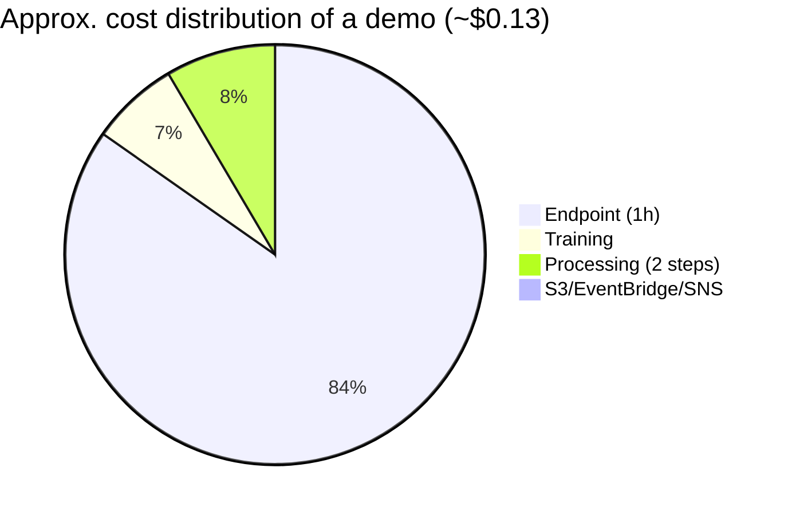

# Estimated costs

The project is **small and for demonstration**, but it has cells that **launch real jobs on AWS**. This guide summarizes what incurs cost, a rough estimate and how to clean up.

> ⚠️ Prices are **approximate** (us-east-1, Oct 2026) and depend on your account and region. On-demand `ml.m5.large` usually runs about **$0.10/h**.

---

## What costs money and how much (~1 demo run)

| Resource | Detail | Typical run | Approx. cost |
|---|---|---|---|
| **SageMaker Processing** `ml.m5.large` (SplitData) | ~2–3 min with synthetic data (5000 rows) | 0.05 h | ~$0.005 |
| **SageMaker Training** `ml.m5.large` (native XGBoost, 100 rounds) | ~3–5 min | 0.08 h | ~$0.008 |
| **SageMaker Processing** `ml.m5.large` (EvaluateFraud) | ~2–3 min | 0.05 h | ~$0.005 |
| **Real-time endpoint** `ml.m5.large` | Billed **per hour while it exists** (even if unused) | 1 h | ~$0.10/h |
| **Model Registry** | Free (metadata; you only pay if you host): | ¥ | $0 |
| **S3** | A few tens of MB | — | <$0.001 |
| **EventBridge + SNS** | 3 rules (trigger + 2 alerts) + topic and 1 email subscription | — | <$0.001 |
| **IAM** | Role + policies | — | $0 |

**Total for a full demo (deploy + 1 h of endpoint):** ≈ **$0.12–$0.15**. If you leave the endpoint running for a whole day: ≈ **$2.40/day**.

---

## What you do NOT pay for while you don't run anything

Importing `fraud_mlops` and running sections 1–10 only **builds objects** (`ScriptProcessor`, `ModelTrainer`, steps, pipeline) and **does not call AWS** (except uploading the CSV and `pipeline.start` itself). The scripts in `code/` cost nothing locally: they run inside the remote SageMaker containers.

The only costly blocks are:
1. The section that **uploads `raw.csv` to S3** (cents).
2. The section that calls `pipeline.start(...)` (the compute minutes).
3. The section that **creates the endpoint** (billed per hour until it is deleted).
4. The **cleanup** cell (it lowers the cost!): removes endpoint and model.

---

## How to keep the spend minimal in a demo

1. **Do not leave the endpoint running:** after inference, run the *cleanup* cell (or delete the endpoint in the console). It is the biggest expense.
2. **Use `PipelineExecution` with cache:** if you re-run with the same data/code, `SplitData` and `EvaluateFraud` are reused (≤ 2 h) and you save 2 processing steps.
3. **Reduce the amount of synthetic data:** the default dataset uses `n_samples=5000` (`dataset.make_fraud_dataframe`); 2000 already works and training drops to ~1–2 min.
4. **Do not touch the services outside the compute sections:** everything else is only definition.
5. **Check `CurrentCost` in SageMaker Studio / Billing** if you want to confirm the forecast before running.

---

## Cleanup (quick answers)

| Resource | How it is removed |
|---|---|
| **Endpoint** | `sm_client.delete_endpoint(EndpointName=ENDPOINT_NAME)` (included in `fraud_mlops.cleanup.cleanup_resources`, section 14) |
| **Model / EndpointConfig** | `delete_model` / `delete_endpoint_config` (same cell) |
| **Pipeline** | `sm_client.delete_pipeline(PipelineName=PIPELINE_NAME)` |
| **Model Registry entries** | `cleanup_model_registry`: deletes versions and groups with the `fraud-detection-mlops-mpg` prefix (retries asynchronous deletion) |
| **Project S3 objects** | `s3.delete_object(...)` on the `fraud-mlops/` bucket/prefix |
| **EventBridge rules** | `fraud_mlops.cleanup.cleanup_resources` deletes the 3 rules and their targets (`events.delete_rule(...)`) |
| **S3 → EventBridge notification** | The cleanup disables `EventBridgeConfiguration` on the bucket (keeps other notifications) |
| **SNS topic** | `sns.delete_topic(...)` |
| **Events role** | `iam.delete_role(...)` (after detaching/deleting the policy) |

> [`src/fraud_mlops/cleanup.py`](../src/fraud_mlops/cleanup.py) groups all these calls (notebook section 14); you decide when to run them so as not to delete shared resources.

---

## Summary

- Even so, if you run it: **≈ $0.13**.
- **The cost of leaving things on** is dominated by the endpoint (~$0.10/h).
- **Always finish with the cleanup** if you are just running the demo.